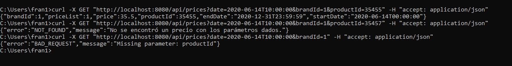

## Kairos Prices Api Test

### Overview
This is a test-based API built using hexagonal architecture, Java 17, and Spring Boot 3.2.0.  
It uses an in-memory H2 database and OpenAPI for API testing and documentation.

### Technologies Used and interesting things
- Java 17  
- Spring Boot  
- H2 Database
- ControllerAdvice
- OpenAPI (Swagger)  
- Flyway for database migrations
- Junit/Mockito Tests
- Integration Tests

### Requirements
- Java 17  
- Maven

### Setup Instructions
1. Open the project at the root directory  
2. Run `mvn clean install`  
3. Run `mvn clean test` to generate test coverage (check the Jacoco report at `target/site/jacoco/index.html`)  
4. Execute the app:  
   `java -jar target/prueba-0.0.1-SNAPSHOT.jar`  

### H2 Database Access
- URL: [http://localhost:8080/h2-console](http://localhost:8080/h2-console)  
- JDBC URL: `jdbc:h2:mem:testdb`  
- Username: `sa`  
- Password: *(leave empty)*  

### Swagger Documentation
- [http://localhost:8080/swagger-ui/index.html](http://localhost:8080/swagger-ui/index.html)  

---

### API Usage Example

#### Endpoint
GET /api/prices

#### Query Parameters

| Name       | Type      | Required | Example                | Description                |
|------------|-----------|----------|------------------------|----------------------------|
| `date`     | `string`  | ✅       | `2020-06-14T10:00:00`  | Date and time (ISO format) |
| `productId`| `long`    | ✅       | `35455`                | ID of the product          |
| `brandId`  | `long`    | ✅       | `1`                    | ID of the brand            |

#### Curl Example Request
###### Test OK
curl -X GET "http://localhost:8080/api/prices?date=2020-06-14T10:00:00&productId=35455&brandId=1" -H "accept: application/json"

###### Test NOT FOUND
curl -X GET "http://localhost:8080/api/prices?date=2020-06-14T10:00:00&productId=35455&brandId=1" -H "accept: application/json"

###### Test BAD REQUEST
curl -X GET "http://localhost:8080/api/prices?date=2020-06-14T10:00:00&brandId=1" -H "accept: application/json"
###### IMG EXAMPLE 

